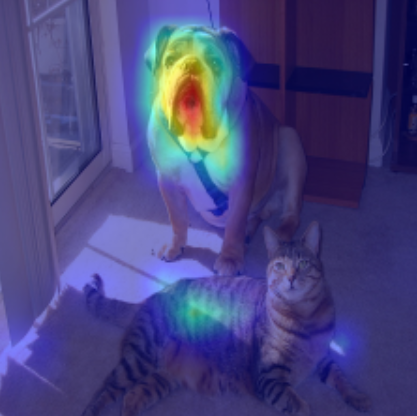
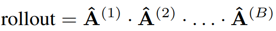
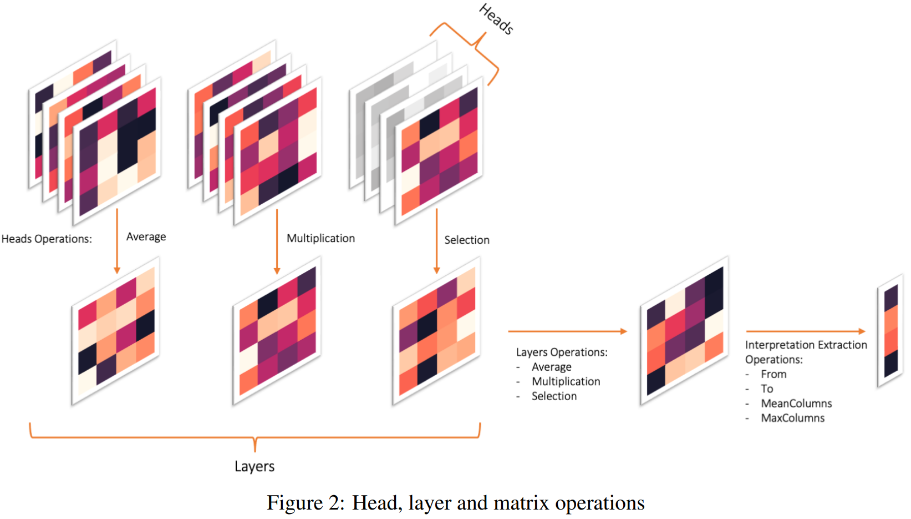
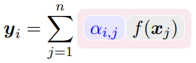
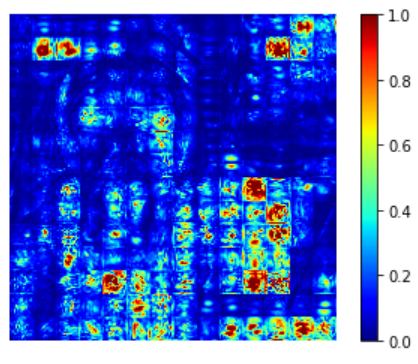
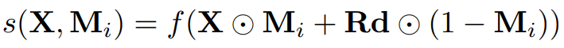

In this artical, we focus on explaing Transformer model's behavior, i.e., on which input features does the Transformer model use to make output (classification) decision. 

We first discuss the most popular method -- Attention-based method, including Raw Attention, Attenion Rollout and its variant, and then talk about applying explanation method in CNN to Transformer.

1. Attention-based method
#### 1.1 Raw attention

Recap that, in self-attention mechnism, the output is the weighted sum of input: 


More specificly, the output $$y_i$$ of token $$i$$ is computed as a weighted sum of all input tokens, where the weights $$\alpha_{ij}$$ are given by the attention matrix$$A$$:

$$y_i = \sum_{j}^{}{\alpha_{i,j} v_j}$$

So intuitively, we can use these weights$$\alpha_{ij}$$from attention matrix$$A$$ to quantify how important is the input tokens to output tokens, where each row corresponds to a relevance map for each token given the other tokens.

Since we focuses on classification models, only the [CLS] token, which encapsulates the explanation of the classification, is considered. The relevance map is, therefore, derived from the row $$C_{[CLS]} ∈ R_s$$ that corresponds to the [CLS] token. This row contains a score evaluating each token's influence on the classification token：


Typically poeple use last layer's attention matrix (yields better result). It's a vector of 1\*197 dim. To visualize it like an image, we can first discard the first element (it's the importance of [CLS] token to [CLS] token; not so important) to get a 1\*196 dim vector, and then reshape it into a 14\*14 matrix to get a token level explanation. But we care about pixel evel explanation, so what we typically do is to use bilinear interpolation to upsample it into a 224*224 image (Same size of input image. Here we use ImageNet dataset's image as an example).

Here's what we get:




Code:

```python
# Look at the total attention between the class token, and the image patches
mask = A[0, 0 , 1:]
# In case of 224x224 image, this brings us from 196 to 14 (width=14)
width = int(mask.shape[-1]**0.5)
mask = mask.reshape(width, width).numpy()
mask = mask / np.max(mask)
# resize到与image尺寸一样，即可得到saliency map
mask = cv2.resize(mask, (image.shape[-1], image.shape[-2]))
plt.imshow(mask)
```

Simply visualize the raw attention matrix is the most popular method. It's very easy to implement, and yet yield intuitive result.

But often the visualizing result is not so idea, either too noisy or not highlighting the true important region. The nice results in paper are often carefully chosen and could not reflect the general explanation performance. Better explanation method is needed.

But how? One direction is exploiting more information from Transformer model. We have more attention map from multiple heads and layers, right? Let's use it to aggregate multiple attention matrices from many heads and layers. But here are some difficulties:

* **(1) Many attention heads**
Many heads are useless -- if we prune most of heads, then the performance will not be affected...

So we can not treat these heads as equal when calculating saliency map.

* **(2) Many attention layers** 
Attentions are combining non-linearly from one layer to the next. 

Sucessful explanation method must have its own way to solve these difficulties.

#### 1.2 Attention Rollout

The Attention rollout method makes a few assumption to simplify the problem:

* **(1) Head aggregation by average**
It assumes all heads are equal, so we can just average over them:

$$E_h A^{(b)} = \frac{1}{M} \sum_{m}^{}{A^{(b)}_m}$$

(here "b" means block b)

* **(2) Layer (Block) aggregation by (attntion) matrix multiplication**
It assumes attentions are combined linearly -- self-attention layers are stacked linealy one after another, and other mechnism (like FFN) does not make any changes of how model using input features to make decision. 

But residual connection matters. So we can model it as $$\hat{A}^{(b)}=I+E_h A^{(b)}$$（you can see it as $$y_i = y_i+\sum_{j}^{}{\alpha_{i,j} v_j}=(1+\alpha_{ii})y_i+\sum_{j\ne i}^{}{\alpha_{i,j} v_j}$$）,  and then normalize it to make each row sum up to 1 again: $$\hat{A}^{(b)}= \hat{A}^{(b)} / \hat{A}^{(b)}.sum(dim=-1)$$.   

And then use matrxi multiplication to aggregate across layers:




This is bc we model the attribution of token$$i$$at block$$b$$to token$$j$$at block$$b+1$$as: 


[]Samira Abnar, Willem Zuidema. 2020. Quantifying Attention Flow in Transformers.

#### 1.3 Generic Attention Explainability (GAE) and Transformer Interpretability Beyond Attention Visualization

To improve, propose a few changes: 

**(1)****Head aggregation****by weighted sum**

* Here we use gradient of attention matrix as its weight, and use weighted sum as Head aggregation
Since each head capture different features, and thus has different importance, and need to be treated differently. So we use gradient to weight it.

Other choices of aggregation, like taking minimum, taking maximum, are less effective as gradient. It also enables a class specific signal. 

$$E_h A^{(b)} = \frac{1}{M} \sum_{m}^{} ∇A^{(b)}_m\odot A^{(b)}_m$$

And in order to compute the weighted attention relevance, we consider only the positive values of the gradients-relevance multiplication, resembling positive relevance.

$$E_h A^{(b)} = \frac{1}{M} \sum_{m}^{} ∇A^{(b)}_m\odot A^{(b)+}_m$$

* **(2) Layer (Block) aggregation by (attntion) matrix multiplication**
Same as before.


Note that in author use relevance score R (calculated from LRP) to replace raw attention maotrix A, but later in they find out that it's not so helpful, so they use attention maotrix A again.

Code:

```python
# attentions has shape [layer, batch, channel, H, W]
# Without LRP
result = torch.eye(attentions[0].size(-1))
with torch.no_grad():
  for attention, grad in zip(attentions, gradients):                
	   weights = grad
	   attention_heads_fused = (attention*weights).mean(axis=1)
	   attention_heads_fused[attention_heads_fused < 0] = 0
	
	   I = torch.eye(attention_heads_fused.size(-1))
	   a = (attention_heads_fused + 1.0*I)/2
	   a = a / a.sum(dim=-1)
	   result = torch.matmul(a, result)
```
[]Hila Chefer, Shir Gur, and Lior Wolf. 2021. Generic Attention-model Explainability for Interpreting Bi-Modal and Encoder-Decoder Transformers.
[]Hila Chefer, Shir Gur, and Lior Wolf. 2021. Transformer Interpretability Beyond Attention Visualization.

#### 1.4 Aggregation methods as hyperparameters

But the results of GAE is not necessary the best. [] Propose that the **ways of aggregating heads, layers:** 

* average, 
* weighted by gradient, or 
* select only a few,
and ways of extracting row from attention matrix: 

* select the row that corresponding [CLS] token,
* average over all columns,
* max over columns 
and even the number of layers are hyperparameters. 


And we should use the one that yield the best evaluation results.

[]Nikolaos Mylonas, Ioannis Mollas, and Grigorios Tsoumakas. 2022. AN ATTENTION MATRIX FOR EVERY DECISION: FAITHFULNESS-BASED ARBITRATION AMONG MULTIPLE ATTENTION-BASED INTERPRETATIONS OF TRANSFORMERS IN TEXT CLASSIFICATION.

#### 1.5 Norm-based method

Argue that although some token might has large attention weights $$\alpha_{ij}$$, their value vector $$f(x_j)$$ is actual very small, so overall it has a small contribution. 




So instead of using attention weights $$\alpha_{ij}$$ as attribution of token $$j$$ to token $$i$$ , propose to use the norm $$||\alpha_{ij}f(x_j)||$$ .

[]Goro Kobayashi, Tatsuki Kuribayashi, Sho Yokoi, Kentaro Inui. 2020. Attention is Not Only a Weight: Analyzing Transformers with Vector Norms. Proceedings of the 2020 Conference on Empirical Methods in Natural Language Processing, pages 7057–7075, 

#### 1.6 Limitation 

(1) Too much simplification: 

* ignore FFN and negative components in each attention block.
* ignore non-linearity in self-attention.

2. Applying explanation methods of CNN to Transformer
Previously we talk about Attention-based method, which is uniquely designed for Transformer because it use a unique element of Transformer -- attention map.

But before Transformer was proposed, there were already many explanability method for CNN, including gradient-based, CAM-based (feature-based), and perturbation-based method. All of them can be modified and applied to explain Transformer model.

#### 2.1 Gradient-based method

We can use Input gradient, Smoothgrad, Integrated Gradient in the exact same way as we use in CNN.

But similar to CNN explanation, we also get very noisy visualizing result. 

And I also observe a strong **checkboard artifact** from visualizing result:




It's probably stem from the strided convolutions in ViT (we use strided convolutions a way to combine cutting image into patches+linear transformation).

For more about strided convolutions causing checkboard artifact, see: [https://distill.pub/2016/deconv-checkerboard/](https://distill.pub/2016/deconv-checkerboard/)

#### 2.2 CAM-based (feature-based) method

**（1）Grad-CAM**

We can extract feature maps as following:

>In ViT the output of the layers are typically BATCH x 197 x 192. In the dimension with 197, the first element represents the class token, and the rest represent the 14x14 patches in the image. We can treat the last 196 elements as a 14x14 spatial image, with 192 channels.
>Since the final classification is done on the class token computed in the last attention block, the output will not be affected by the 14x14 channels in the last layer. The gradient of the output with respect to them, will be 0!
>We should chose any layer before the final attention block, for example:
```plain
target_layers = [model.blocks[-1].norm1]
```

And gradient can be calculated easily using backprop. We use gradient as weights of features, and then Combine those two terms, we get **Grad-CAM**.

[ ][pytorch-grad-cam/vision_transformers.md at master · jacobgil/pytorch-grad-cam · GitHub](https://github.com/jacobgil/pytorch-grad-cam/blob/master/tutorials/vision_transformers.md)

**(2) ViT-CX**

We first extract feature maps as above.

But instead of using gradient as weight, we first apply feature maps as masks M to perturbe input X, and then the output is the weight. 




Here Rd is a matrix of random numbers, which has the same size as feature map

The intuition is, if feature map highlight important region of input image, then retaining these region by $$X\odot M_I$$ and masking other region out (or blur it with$$Rd\odot(1-M_i)$$ ) will yield a high output classification score.

[]Weiyan Xie, Xiao-Hui Li, Caleb Chen Cao, and Nevin L. Zhang. 2022. ViT-CX: Causal Explanation of Vision Transformers.

#### 2.3 Perturbation-based method

(1) Value Zeroing []

Perturbation-based method aims to measure how much a token uses other context tokens to build its output representation $$\tilde{x}_i$$ at each encoder layer by perturbing input token.

In Value Zeroing, to measure attribution of input token $$i$$ to output token $$j$$ , it zeros the input value vector of token$$i$$when calculating the output of token $$j$$ :




set $$v_j$$=0

This provides an alternative output representation$$\tilde{x}_i^{-j}$$. And then measure how much output changes by:

$$C_{i,j} = \tilde{x}_i^{-j} * \tilde{x}_i$$

where the operation ∗ can be any pairwise distance metric (eg. cosine distance).

The intuition is, if input token $$i$$ is important to output token $$j$$ , then masking input token $$i$$ out will make $$\tilde{x}_i$$ change a lot and yield a large distance between $$\tilde{x}_i$$and$$\tilde{x}_i^{-j}$$.

For all input token $$i$$ and output token $$j$$ , we can calculate $$C_{i,j}$$ as above, generating a map similar to attention map. And then we can aggragate over layers and heads as before.

[1] Hosein Mohebbi, Willem Zuidema, Grzegorz Chrupała, and Afra Alishahi. 2023. Quantifying Context Mixing in Transformers.

3. Useful resources
[1] A great talk by Hila Chefer for attention-based method: [Hila Chefer - Transformer Explainability](https://www.youtube.com/watch?v=A1tqsEkSoLg)

[2] A good tutorial: [https://github.com/jacobgil/vit-explain](https://github.com/jacobgil/vit-explain)

4. Reference
