Adversarial generalisation

It\'s a ML technique for \"preparing and generalizing for the worst
case\".

Make a model generalise well in any environment \<\--\> generalise well
in the worst case.

Two methods:

{width="4.904027777777777in"
height="1.1353094925634295in"}

Formulation of adversarial environment 

For an adversarial environment, we have:

● **Adversarial goal** defines which environment is \"worst\" for your
model.

● **Strategy space** defines the space of possible environments from
which the devil can choose. (and they choose the worst from it)

● **Lower bound guarantee**: Your model\'s performance against the
worst-case environment provides a lower bound on its performance against
the space of possible environments.

● **Caveat**: The guarantee is only within the pre-set space of possible
environments. 

● **Knowledge** (Adversary\'s knowledge on the target model  \-- what
they can get from the attacked model) defines the devil\'s ability to
pick the worst environment for your model. 

● **White box attack**: Access to model architecture and weights, or we
can obtain the input gradients from the model.

● **Black-box attack**: You observe only the inputs and outputs to a
model. 

White-box Attack

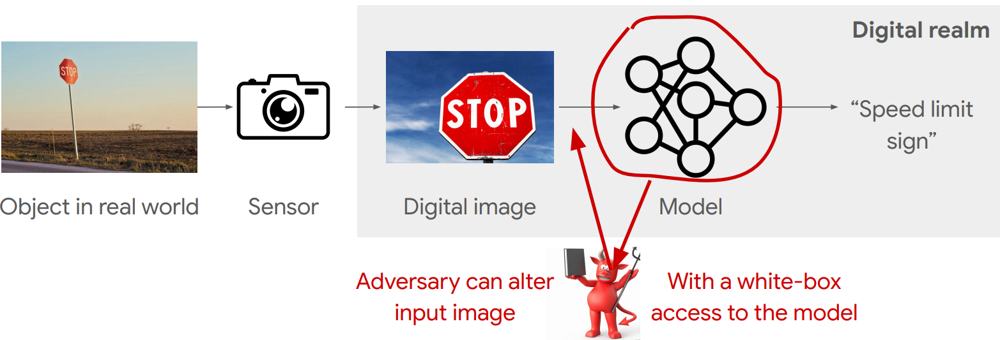{width="4.885416666666667in"
height="1.6638506124234471in"}

1.FGSM (Fast Gradient Sign Method) attack

L-inf adversarial attack. 

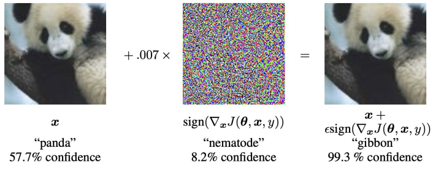{width="3.9269444444444446in"
height="1.5463035870516186in"}

● **Goal**: Reduce classification accuracy, while being imperceptible to
humans.

● **Space**: For every sample, adversary may add a perturbation dx with
norm \|\|dx\|\|\_inf \< ε.

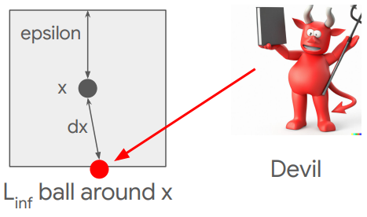{width="2.0006944444444446in"
height="1.182422353455818in"}

● **Knowledge**: Access to model architecture and weights (white box
attack).

FGSM as L-inf attack

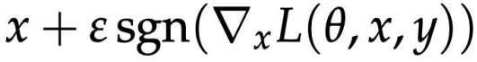{width="2.382222222222222in"
height="0.3095538057742782in"}

where:

L: Loss value for model θ, input x, and ground-truth label y.

sgn: Takes value +1 for positive values, takes value -1 for negative
values.

ε: Size of the perturbation. It determines the L-inf norm of the
attack. 

We can show that \|\|ε·sgn(\...)\|\|inf \< ε, so after the update, x is
still within the space.

2.PGD (Projected Gradient Descent) attack 

Lp adversarial attack (1 ≤ p ≤ ∞).

{width="3.033611111111111in"
height="1.148137576552931in"}

● Goal: Reduce classification accuracy, while being imperceptible to
humans.

● Space: For every sample, adversary may add a perturbation dx with norm
\|\|dx\|\|p \< ε.

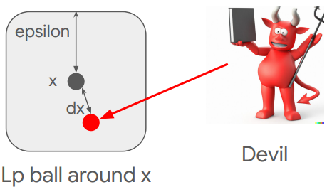{width="2.047222222222222in"
height="1.2042475940507436in"}

● Knowledge: Access to model architecture and weights (white box
attack). 

PGD as Lp attack

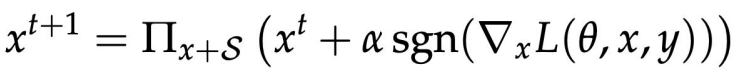{width="3.5454166666666667in"
height="0.37522637795275593in"}

where:

t: Iteration index

α: Step size for each iteration.

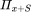{width="0.29777777777777775in"
height="0.11166666666666666in"}: Projection on the Lp sphere around x. 

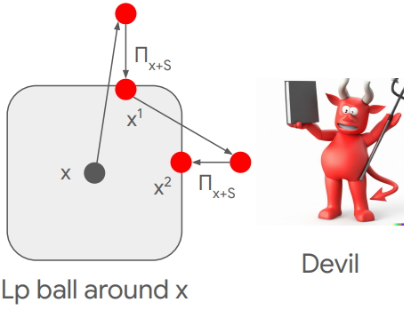{width="1.8983333333333334in"
height="1.4340212160979877in"}

Short summary: FGSM vs PGD

● Optimisation problem for adversary is non-convex.

● No guarantee for the optimal solution, even within an epsilon ball
(it's not tiny in a high-dim space).

● Strength of the attack depends a lot on the optimisation algorithm.

● PGD is generally much stronger than FGSM; PGD finds better optima.

● PGD is generally the state of the art attack even now. 

Exploring different strategy spaces 

(Use different ways to measure the change of original image.)

● So far: Pick perturbation inside an Lp ball (a norm 1 ball).

● Problem with Lp ball as strategy spaces: it is not aligned with
human\'s perception.

Small image translations result in small (huge) L2 distances but result
in perceptually huge (small) distances.

Example: Which pair looks more similar to each other? 

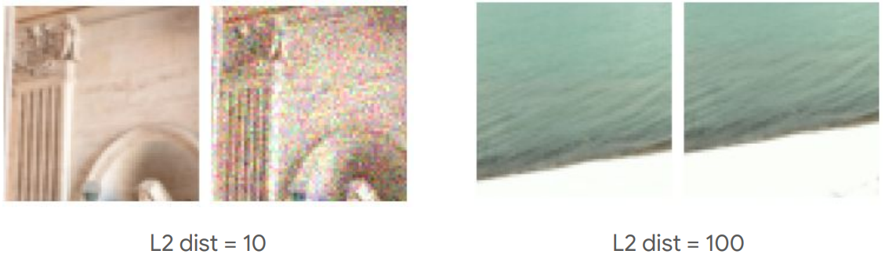{width="3.908333333333333in"
height="1.1735378390201225in"}

左图：img and img after translation

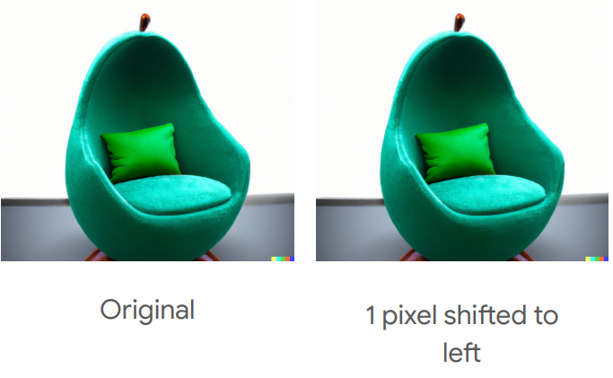{width="2.8475in"
height="1.7551935695538057in"}

Can we define a metric that assigns small distances to small image
translations? \--\> Optical flow! 

3.Flow-based attack

Optical flow distance

● Optical flow measures the smallest warping of the underlying image
mesh to transform x1 into x2 .

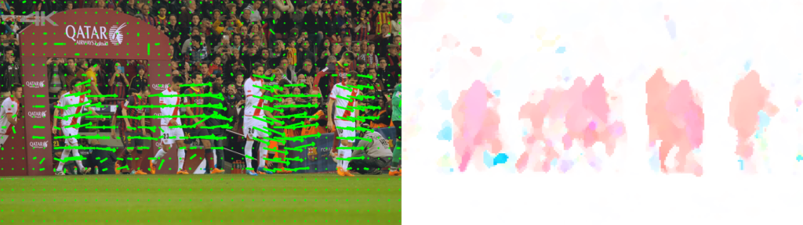{width="4.075833333333334in"
height="1.146327646544182in"}

● Optical flow is represented as a vector field over the 2D space.

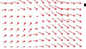{width="1.59125in"
height="0.9119444444444444in"}

● Here, the size of the warping may be computed via total variation.

Adversarial flow-based perturbation

● Adversary warps the underlying mesh for the image according to f such
that the classification result is wrong. 

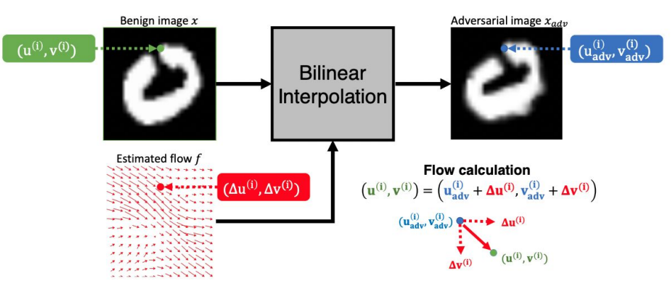{width="4.810972222222222in"
height="2.0676509186351706in"}

● Strategy space: Flows f with the size of total variation less than δ.

● \|\| f \|\|\_{TV} ≤ δ

4.Physical attacks 

Lp attacks, optical flow attack and other attacks that alter the digital
image.

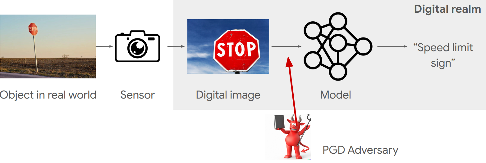{width="5.5in" height="1.8497440944881889in"}

But do such adversaries exist in the real world? Sometimes basic
security technology can already prevent such adversaries.

So the more practical and more common attack is Physical attacks!

Physical attacks 

{width="3.1918055555555553in"
height="1.8654516622922135in"}

Physically change the object in real world.

● Adversaries usually do have the necessary access to real-world
objects. 

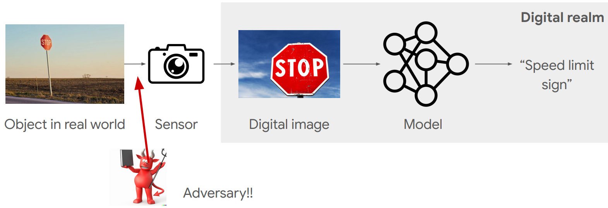{width="5.27625in"
height="1.810246062992126in"}

5.Other strategy spaces: Object poses in 3D world 

● Strategy space: Changes in object poses.

● Doesn\'t necessarily care about \"small\" changes in object pose. 

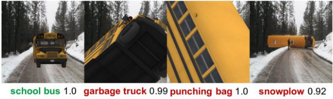{width="4.1130555555555555in"
height="1.231489501312336in"}

Black-box attack

The white-box attack we discuss above requires input gradients from the
model, which is stronger but less realistic than black-box attack.

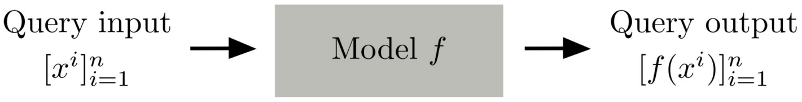{width="4.69in" height="0.6006889763779527in"}

Many real-world applications are based on API access, so there are
further limitations:

○ Number of queries within a time window (rate limit).

○ Possible blocking of malicious query inputs.

Example:

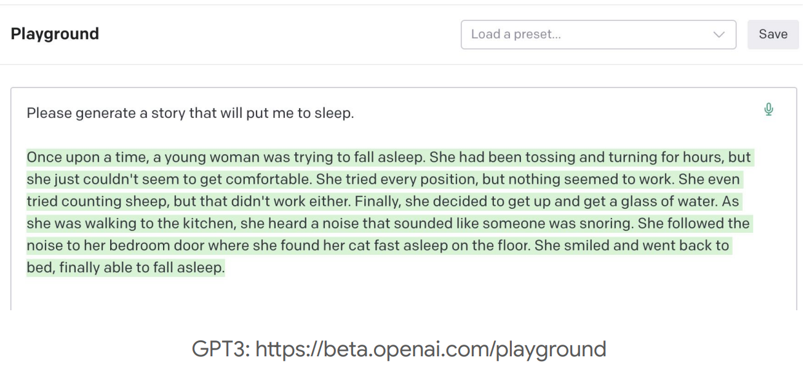{width="4.327083333333333in"
height="1.9831080489938757in"}

Black-box attack via substitute model 

**Step 1**: Gather input-output pairs from the original model (API
calls). 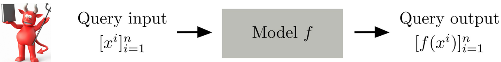{width="5.5in"
height="0.6829768153980752in"}

**Step 2**: Train a substitute model g with the input-output pairs. g is
expected to be similar to the original model f.

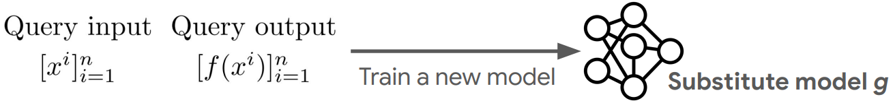{width="5.5in" height="0.6428565179352581in"}

Adversary uses g to generate white-box attacks.

Hope that this attack also works for f.

Usually it does attack f too.

Black-box attack via zeroth-order attack 

Attack in the same way as we attack white-box model, but we have to
approximate gradient

● One can indeed approximate model gradient only with API calls!

● For h small enough, one can approximate the gradient numerically:

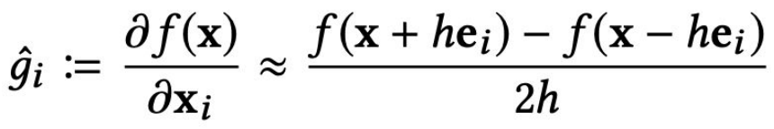{width="3.2848611111111112in"
height="0.5500229658792651in"}

● But much less efficient than backpropagation.

Framework:

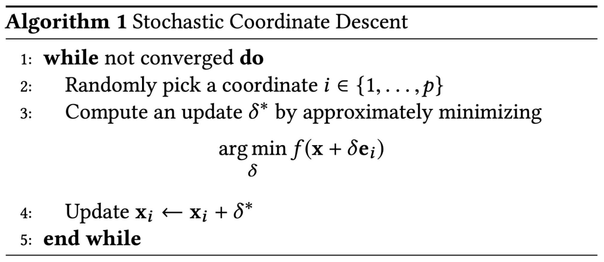{width="3.7594444444444446in"
height="1.637876202974628in"}

The most challenging part in Algorithm above is to compute the best
coordinate update in step 3. Different methods exist.

Defense

There are many defense methods, but we\'ll touch upon one representative
defense method for the lecture.

Adversarial training 

Include attack samples in the training batch. 

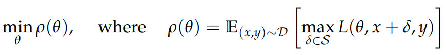{width="4.466666666666667in"
height="0.5596161417322835in"}

Instead of feeding samples from the distribution D directly into the
loss L, we allow the adversary to perturb the input first. This gives
rise to a saddle point problem (Minimax formulation).

One can interpret attack as a scheme for maximizing the inner part of
the saddle point formulation

● Caveat: Adversarial training is very difficult to perform at scale. 

Reasons why some other defense are not so effective? 

● Defenses are specifically targetted against gradient-based attacks.

● They only make the gradient malfunction - to mislead gradient-based
attacks.

● The model itself is still vulnerable.

● One can use slight modification of gradient-based attacks to attack it
again.

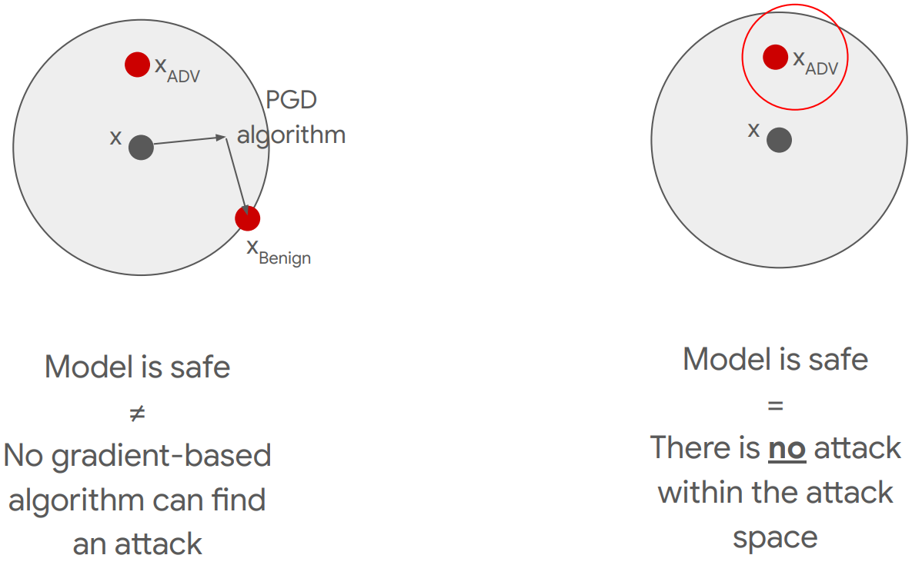{width="3.4988888888888887in"
height="2.1701968503937006in"}

Example: Input transformations 

By apply image transformations (and random combination of them)
(Cropping and rescaling, Bit-depth reduction, JPEG encoding +
decoding\....), you can \*removing\* adversarial effects from the input
image.

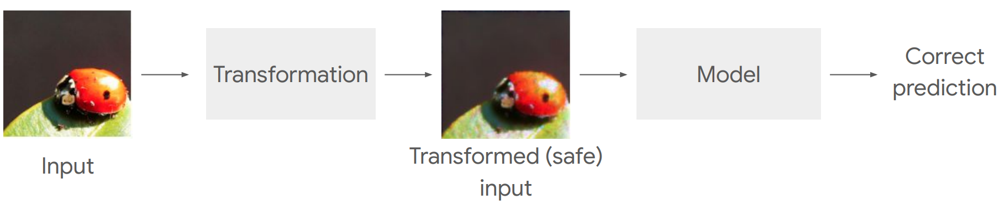{width="4.792361111111111in"
height="0.9849486001749781in"}

It\'s a successful defense for PGD, FGSM. But if we modify the attack by
incoperating the information of transformation, we could still attack it
successfully:

● Defense by cropping and rescaling (differentiable transformations):

○ Attack by differentiable transformation \-- attack the joint network
that incoperate the transformation.

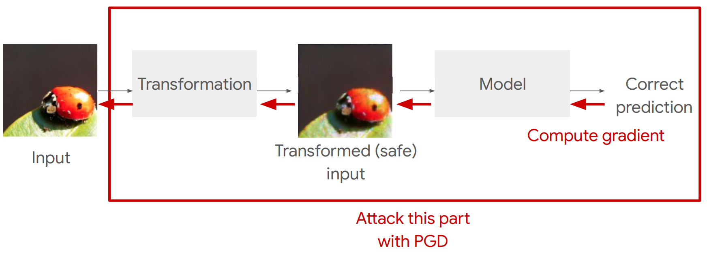{width="4.075833333333334in"
height="1.4980555555555555in"} 

● Defense by other discrete transformations:

○ Attack by differentiating \"through\" quantisation layers. (Use
straight-through estimator to estimate the gradient of discrete
transformations \-- see it as identity mapping and ignore its gradient)

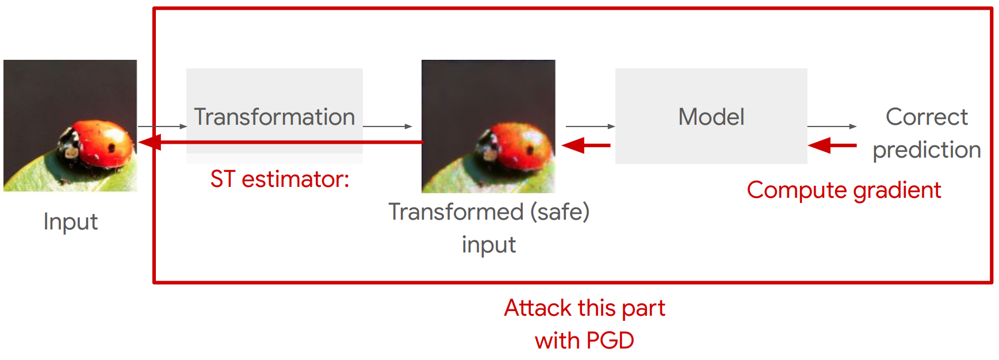{width="4.317777777777778in"
height="1.5560903324584427in"}

● Defense by random mixture of transformations:

○ Attack by performing expectation over transformations (EOT):

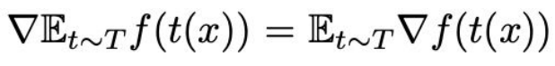{width="2.9033333333333333in"
height="0.3476476377952756in"}

{width="4.466666666666667in"
height="1.5882622484689415in"}

(In practice, average all gradients (which all incoperate
transformation))

EoT can attack against gradient obfuscations, but there\'s a defense
against EoT \-- BaRT

Barrage of Random Transforms (BaRT)

● Introduce 10 groups of possible image transformations.

> ○ Color Precision Reduction
>
> ○ JPEG Noise
>
> ○ Swirl
>
> \...
>
> ○ Denoising

● And apply them with random sequence.

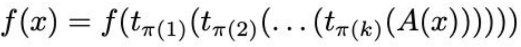{width="2.9033333333333333in"
height="0.26663167104111984in"}

Certified defenses 

Some theoretical analysis (not so meaningful in practice) + deriving
defense method from it.

Given a two-layer neural network: f(x) = V σ(Wx) (assumption too strong)

, where V and W are matrices, and σ( ) is a non-linearity with bounded
gradients. E.g. ReLU or sigmoid. 

We write the following for the worst-case adversarial attack. 

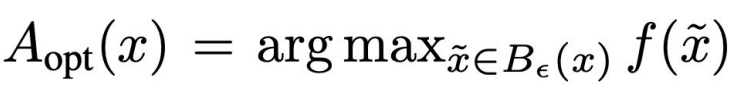{width="2.7079166666666667in"
height="0.3375721784776903in"}

(\"A\" means attack)

They have produced the following upper bounds on the severity of
adversarial attack:

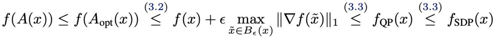{width="4.94125in"
height="0.3887784339457568in"}

, where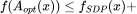{width="1.274861111111111in"
height="0.13027777777777777in"}a term

To defense, we can incoperate the second term in loss in some way, and
formulate the following optimization problem instead of ERM:

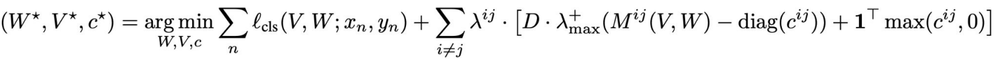{width="5.5in" height="0.37166557305336834in"}

Given V\[t\], W\[t\] and c\[t\] values at iteration t, one obtains the
guarantee for any attack A:

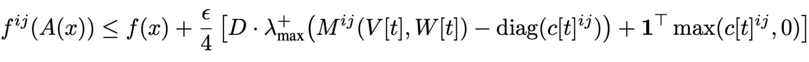{width="4.745833333333334in"
height="0.36685476815398077in"}

(The severity of attack is reduced)

History

{width="4.7179166666666665in"
height="2.279909230096238in"}

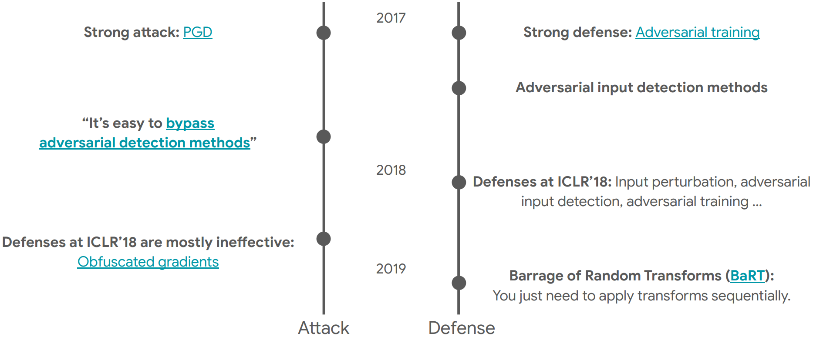{width="5.006388888888889in"
height="2.0969444444444445in"}

2020 - : Stop the cat and mouse game!

It\'s a dead end.

Future

Considered attacks are way too strong. Instead more work towards less
pessimistic defense:

● Defense against black box attacks.

● Defense against non-adversarial, non-worst case perturbations:

● OOD generalisation

● Domain generalisation

● Cross-bias generalisation. 

Alternatives:

1\. Diversify and randomise (eg BaRT)

2\. Certified defenses

3\. Deal with realistic threats, rather than unrealistic worst-case
threats. 

Summary

● DNNs are vulnerable within small Lp ball.

● Attacks and defenses tend to be a cat and mouse game.

● People seek alternative directions, such as domain generalisation
